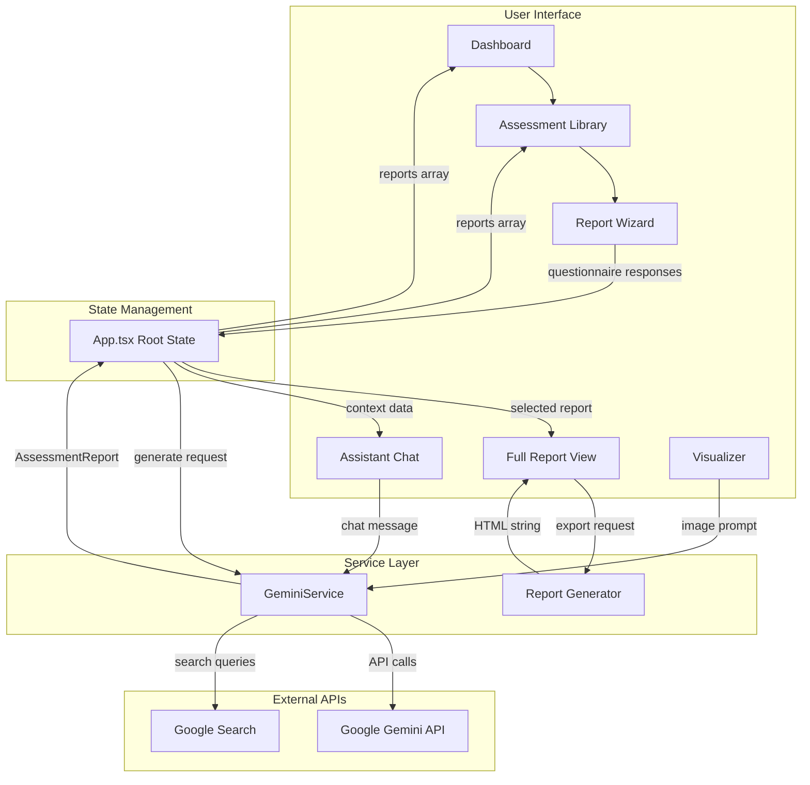

<div align="center">

# Innovation Compass

### AI-Powered Innovation Assessment & IP Intelligence Platform

[](https://react.dev/)
[](https://www.typescriptlang.org/)
[](https://vitejs.dev/)
[](https://ai.google.dev/)
[](https://tailwindcss.com/)

---

**A high-fidelity platform for generating investor-grade Innovation Compass Reports**
*Deep technical forensics • IP landscape analysis • Market reality stress-testing*

[Getting Started](#getting-started) • [Architecture](#architecture-overview) • [Features](#key-features) • [Tutorial](#usage-tutorial)

</div>

---

## Table of Contents

- [Overview](#overview)
- [Key Features](#key-features)
- [Technology Stack](#technology-stack)
- [Architecture Overview](#architecture-overview)
- [Project Structure](#project-structure)
- [Getting Started](#getting-started)
- [Usage Tutorial](#usage-tutorial)
- [Component Reference](#component-reference)
- [Data Models](#data-models)
- [AI Integration](#ai-integration--multi-agent-system)
- [Report Schema](#report-schema)
- [Configuration](#configuration)
- [Development Guide](#development-guide)
- [Troubleshooting](#troubleshooting)

---

## Overview

**Innovation Compass** is an enterprise-grade platform that leverages Google's Gemini AI to conduct comprehensive innovation assessments. The system orchestrates multiple specialized AI agents to analyze technology claims, intellectual property landscapes, market dynamics, regulatory pathways, and financial viability.

### What It Does

```
┌─────────────────────────────────────────────────────────────────────────────┐
│                                                                             │
│   📋 Questionnaire     ──►    🤖 AI Analysis    ──►    📊 Comprehensive    │
│      Input                      Engine                   Report            │
│                                                                             │
│   ┌─────────────┐           ┌─────────────┐          ┌─────────────────┐   │
│   │ Innovation  │           │ 6 Parallel  │          │ 50+ Page Report │   │
│   │ Details     │    ──►    │ AI Agents   │   ──►    │ with Scoring    │   │
│   │ Sector Info │           │ Deep CoT    │          │ & Visualizations│   │
│   │ Claims      │           │ Reasoning   │          │ PDF Export      │   │
│   └─────────────┘           └─────────────┘          └─────────────────┘   │
│                                                                             │
└─────────────────────────────────────────────────────────────────────────────┘
```

---

## Key Features

| Feature | Description |
|---------|-------------|
| **Multi-Agent AI Analysis** | 6 specialized AI agents (Technologist, Patent Attorney, Market Strategist, Regulatory Consultant, Commercial Lead, Synthesis Director) work in parallel |
| **Sector-Weighted Scoring** | Deterministic risk scoring with industry-specific weighting for 8 sectors |
| **IP Risk Radar Visualization** | Spatial radar showing patent landscape with animated concentric orbits, FTO risk plotting, and "Clean IP Landscape" messaging |
| **Executive Verdict Box** | Strategic recommendation framework with condition gating, investment requirements, and risk gauge visualization |
| **Interactive Dashboard** | Real-time portfolio KPIs, risk distribution charts, and activity monitoring |
| **AI Chat Assistant** | Context-aware analyst for follow-up questions with Google Search integration |
| **Product Visualizer** | AI-powered concept image generation using Gemini's vision models |
| **Print-Ready Reports** | Professional HTML/PDF export with investor-grade formatting and Dr. Arcus A.I. digital signature |
| **Technology Readiness Levels** | TRL 1-9 assessment with subsystem-level granularity and animated timeline visualization |
| **IP Deep Dive** | Patent landscape analysis, FTO assessment, filing strategy recommendations, and blocking patent detection |
| **Market Sizing (TAM/SAM/SOM)** | Three-tier market analysis with Total Addressable, Serviceable Available, and Serviceable Obtainable Markets |
| **Decision Logic Tree** | Visual Go/No-Go framework with conditional branching and strategic pathway analysis |

---

## Technology Stack

<div align="center">

### Frontend

```
┌──────────────────────────────────────────────────────────────────┐
│                         FRONTEND LAYER                           │
├───────────────┬───────────────┬────────────────┬────────────────┤
│    React      │  TypeScript   │  Tailwind CSS  │   Font Awesome │
│    19.2.3     │    5.8.2      │     (CDN)      │     6.4.0      │
│               │               │                │                │
│  Component    │ Static Type   │  Utility-First │  Icon Library  │
│  Framework    │   Checking    │     CSS        │                │
└───────────────┴───────────────┴────────────────┴────────────────┘
```

### Build & Development

```
┌──────────────────────────────────────────────────────────────────┐
│                      BUILD TOOLCHAIN                             │
├──────────────────────────┬───────────────────────────────────────┤
│         Vite 6.2.0       │            Node.js                    │
│                          │                                       │
│   • Lightning-fast HMR   │   • ES Modules (type: "module")       │
│   • ES Module Bundling   │   • Development Server                │
│   • Environment Vars     │   • Port 3000 (0.0.0.0)               │
└──────────────────────────┴───────────────────────────────────────┘
```

### AI & External Services

```
┌──────────────────────────────────────────────────────────────────┐
│                     AI & SERVICES                                │
├────────────────┬────────────────┬────────────────┬──────────────┤
│ Google Gemini  │    marked.js   │    jsPDF       │ Google Fonts │
│   @google/     │     15.0.0     │    2.5.1       │              │
│   genai 1.34.0 │                │                │  Plus Jakarta│
│                │  Markdown to   │ PDF Generation │  Inter       │
│ • Flash Model  │    HTML        │   Library      │  JetBrains   │
│ • Pro Vision   │  Rendering     │                │  Mono        │
│ • Search Tool  │                │                │              │
└────────────────┴────────────────┴────────────────┴──────────────┘
```

</div>

### Dependencies Summary

| Package | Version | Purpose |
|---------|---------|---------|
| `react` | ^19.2.3 | UI component framework |
| `react-dom` | ^19.2.3 | React DOM bindings |
| `@google/genai` | ^1.34.0 | Google Gemini AI SDK |
| `marked` | 15.0.0 | Markdown parsing |
| `jspdf` | 2.5.1 | PDF generation |
| `typescript` | ~5.8.2 | Static type checking |
| `vite` | ^6.2.0 | Build tool & dev server |

### Typography & Fonts

The platform uses a carefully curated font stack for professional presentation:

| Font Family | Usage | Source |
|-------------|-------|--------|
| **Playfair Display** | Display headers, report cover titles, section headings | Google Fonts |
| **Dancing Script** | Dr. Arcus A.I. signature (Director's Insights) | Google Fonts |
| **Inter** | Primary body text, UI elements | Google Fonts |
| **Plus Jakarta Sans** | Alternative sans-serif, dashboard elements | Google Fonts |
| **JetBrains Mono** | Technical details, report IDs, code snippets | Google Fonts |
| **Font Awesome** | Icons throughout the interface | CDN (6.4.0) |

**Design Notes:**
- Serif (Playfair Display) provides gravitas for investor-facing content
- Dancing Script adds personalized touch to AI director signature
- Inter ensures excellent readability at all sizes
- JetBrains Mono maintains clarity for technical specifications

---

## Architecture Overview

### High-Level System Architecture

```
┌─────────────────────────────────────────────────────────────────────────────────────┐
│                              INNOVATION COMPASS PLATFORM                            │
├─────────────────────────────────────────────────────────────────────────────────────┤
│                                                                                     │
│  ┌─────────────────────────────────────────────────────────────────────────────┐   │
│  │                           PRESENTATION LAYER                                 │   │
│  │                                                                              │   │
│  │   ┌──────────┐  ┌──────────┐  ┌──────────┐  ┌──────────┐  ┌──────────┐     │   │
│  │   │Dashboard │  │Assessment│  │ Report   │  │  Chat    │  │Visualizer│     │   │
│  │   │          │  │ Library  │  │  Wizard  │  │ Assistant│  │          │     │   │
│  │   └────┬─────┘  └────┬─────┘  └────┬─────┘  └────┬─────┘  └────┬─────┘     │   │
│  │        │              │              │              │              │          │   │
│  └────────┼──────────────┼──────────────┼──────────────┼──────────────┼──────────┘   │
│           │              │              │              │              │              │
│           ▼              ▼              ▼              ▼              ▼              │
│  ┌─────────────────────────────────────────────────────────────────────────────┐   │
│  │                           APPLICATION LAYER                                  │   │
│  │                                                                              │   │
│  │   ┌──────────────────────────────────────────────────────────────────────┐  │   │
│  │   │                         App.tsx (Root)                                │  │   │
│  │   │  • Tab Navigation    • State Management    • Report Orchestration     │  │   │
│  │   └──────────────────────────────────────────────────────────────────────┘  │   │
│  │                                      │                                       │   │
│  └──────────────────────────────────────┼───────────────────────────────────────┘   │
│                                         │                                           │
│                                         ▼                                           │
│  ┌─────────────────────────────────────────────────────────────────────────────┐   │
│  │                            SERVICE LAYER                                     │   │
│  │                                                                              │   │
│  │   ┌────────────────────────────────────────────────────────────────────┐    │   │
│  │   │                      GeminiService                                  │    │   │
│  │   │                                                                     │    │   │
│  │   │  ┌─────────────┐  ┌─────────────┐  ┌─────────────┐                 │    │   │
│  │   │  │ generate    │  │ chatWith    │  │ generate    │                 │    │   │
│  │   │  │ Assessment()│  │ Analyst()   │  │ ProductConcept()              │    │   │
│  │   │  └─────────────┘  └─────────────┘  └─────────────┘                 │    │   │
│  │   └────────────────────────────────────────────────────────────────────┘    │   │
│  │                                      │                                       │   │
│  └──────────────────────────────────────┼───────────────────────────────────────┘   │
│                                         │                                           │
│                                         ▼                                           │
│  ┌─────────────────────────────────────────────────────────────────────────────┐   │
│  │                           EXTERNAL SERVICES                                  │   │
│  │                                                                              │   │
│  │   ┌──────────────────────┐  ┌──────────────────────┐                        │   │
│  │   │   Google Gemini AI   │  │   Google Search      │                        │   │
│  │   │                      │  │       Tool           │                        │   │
│  │   │  • gemini-3-pro-preview      │  │                │                        │   │
│  │   │  • gemini-3-flash-preview   │  │  Market Intel  │                        │   │
│  │   │  • gemini-3-pro-image-prev  │  │  Real-time Data│                        │   │
│  │   └──────────────────────┘  └──────────────────────┘                        │   │
│  │                                                                              │   │
│  └─────────────────────────────────────────────────────────────────────────────┘   │
│                                                                                     │
└─────────────────────────────────────────────────────────────────────────────────────┘
```

### Component Data Flow



### Navigation Flow

```
┌──────────────────────────────────────────────────────────────────────────────┐
│                               APP NAVIGATION                                 │
├──────────────────────────────────────────────────────────────────────────────┤
│                                                                              │
│  ┌──────────┐                                                                │
│  │ SIDEBAR  │                                                                │
│  │          │      ┌────────────────────────────────────────────────────┐   │
│  │ ┌──────┐ │      │                                                    │   │
│  │ │  📊  │─┼──────►              DASHBOARD                             │   │
│  │ └──────┘ │      │   • Portfolio KPIs     • Recent Activity           │   │
│  │          │      │   • Risk Distribution  • Quick Actions             │   │
│  │ ┌──────┐ │      └────────────────────────────────────────────────────┘   │
│  │ │  📁  │─┼──────►              ASSESSMENT LIBRARY                        │
│  │ └──────┘ │      │   • Search & Filter    • Report Cards              │   │
│  │          │      │   • Download/Delete    • Status Indicators         │   │
│  │ ┌──────┐ │      └────────────────────────────────────────────────────┘   │
│  │ │  💬  │─┼──────►              AI ANALYST CHAT                           │
│  │ └──────┘ │      │   • Context Selection  • Markdown Responses        │   │
│  │          │      │   • Thinking Indicators • Search Integration       │   │
│  │ ┌──────┐ │      └────────────────────────────────────────────────────┘   │
│  │ │  🎨  │─┼──────►              PRODUCT VISUALIZER                        │
│  │ └──────┘ │      │   • Concept Prompts    • Image Generation          │   │
│  │          │      │   • Resolution Options • Gallery View              │   │
│  │ ┌──────┐ │      └────────────────────────────────────────────────────┘   │
│  │ │  ⚙️  │─┼──────►              SETTINGS                                  │
│  │ └──────┘ │      │   • API Configuration  • Health Monitoring         │   │
│  │          │      │   • System Status      • Compliance Info           │   │
│  └──────────┘      └────────────────────────────────────────────────────┘   │
│                                                                              │
└──────────────────────────────────────────────────────────────────────────────┘
```

---

## Project Structure

```
innovation-compass/
│
├── 📁 components/                    # React UI Components
│   ├── Sidebar.tsx                   # Navigation sidebar (77 lines)
│   ├── Dashboard.tsx                 # Main dashboard with KPIs (288 lines)
│   ├── AssessmentLibrary.tsx         # Report grid view (120 lines)
│   ├── ReportWizard.tsx              # Multi-step questionnaire (572 lines)
│   ├── FullReportView.tsx            # Detailed report display (1,482 lines)
│   ├── AssistantChat.tsx             # AI chat interface (321 lines)
│   ├── Visualizer.tsx                # Image generation (155 lines)
│   ├── Settings.tsx                  # Configuration panel (194 lines)
│   ├── AssessmentCard.tsx            # Report card component (162 lines)
│   └── Footer.tsx                    # Footer with methodology modal (185 lines)
│
├── 📁 services/
│   └── geminiService.ts              # Gemini AI integration (842 lines)
│
├── 📁 utils/
│   ├── reportGenerator.ts            # HTML report generation (456 lines)
│   └── reportTemplate.ts             # Report HTML template (1,385 lines)
│
├── 📁 data/
│   └── mockReports.ts                # Example report data (35KB)
│
├── 📁 reference-outputs/             # Sample PDF exports
│   ├── Innovation Compass Assessment-004.pdf
│   ├── Innovation Compass Assessment-005-Current.pdf
│   ├── Innovation Compass Assessment-006-Current.pdf
│   └── Innovation Compass Assessment-Edits.pdf
│
├── 📄 App.tsx                        # Root application component
├── 📄 index.tsx                      # React entry point
├── 📄 index.html                     # HTML template with CDN resources
├── 📄 types.ts                       # TypeScript type definitions (436 lines)
├── 📄 vite.config.ts                 # Vite build configuration
├── 📄 tsconfig.json                  # TypeScript configuration
├── 📄 package.json                   # Dependencies & scripts
└── 📄 metadata.json                  # Application metadata
```

### File Size Reference

| Category | Files | Total Lines |
|----------|-------|-------------|
| Components | 10 | ~3,634 |
| Services | 1 | ~842 |
| Utilities | 2 | ~1,841 |
| Types | 1 | ~436 |
| **Total** | **14** | **~6,753** |

---

## Getting Started

### Prerequisites

- **Node.js** (v18 or higher recommended)
- **Google Gemini API Key** ([Get one here](https://ai.google.dev/))

### Installation

```bash
# 1. Clone the repository
git clone <repository-url>
cd innovation-compass

# 2. Install dependencies
npm install

# 3. Configure environment
# Create a .env file and add your Gemini API key:
echo "VITE_GOOGLE_API_KEY=your_api_key_here" > .env
# Then edit .env with your actual API key
# Get your API key from: https://aistudio.google.com/app/apikey

# 4. Start development server
npm run dev
```

### Available Scripts

| Script | Command | Description |
|--------|---------|-------------|
| Development | `npm run dev` | Start Vite dev server on port 3000 |
| Build | `npm run build` | Create production build in `dist/` |
| Preview | `npm run preview` | Preview production build locally |

### Environment Variables

| Variable | Required | Description |
|----------|----------|-------------|
| `VITE_GOOGLE_API_KEY` | Yes | Your Google Gemini API key - VITE_ prefix required for client-side access. Get it from https://aistudio.google.com/app/apikey |

---

## Usage Tutorial

### Step 1: Creating a New Assessment

```
┌─────────────────────────────────────────────────────────────────────────────┐
│                         REPORT WIZARD WORKFLOW                              │
├─────────────────────────────────────────────────────────────────────────────┤
│                                                                             │
│  STEP 1              STEP 2              STEP 3              STEP 4        │
│  ┌─────────┐        ┌─────────┐        ┌─────────┐        ┌─────────┐      │
│  │ Basic   │   ──►  │Technical│   ──►  │ Market  │   ──►  │ IP &    │      │
│  │ Info    │        │ Claims  │        │ Context │        │ Location│      │
│  └─────────┘        └─────────┘        └─────────┘        └─────────┘      │
│                                                                             │
│  • Innovation Name   • Key Components   • Competitors      • IP Status     │
│  • Problem           • Technical        • Differentiation  • Geographic    │
│  • Solution            Claims           • Target Customer    Focus         │
│  • Sector                                                                   │
│  • Stage                                                                    │
│                                                                             │
└─────────────────────────────────────────────────────────────────────────────┘
```

**Questionnaire Fields:**

| Field | Type | Required | Description |
|-------|------|----------|-------------|
| Innovation Name | Short Text | Yes | Name of the technology/product |
| Problem Statement | Long Text | Yes | What problem does it solve? |
| Solution Description | Long Text | Yes | How does your solution work? |
| Sector | Select | Yes | Industry vertical (9 options) |
| Development Stage | Select | Yes | Concept/PoC/Prototype/Pilot |
| Key Technical Components | Multi-Entry | Yes | 3-5 core technology elements |
| Technical Claims | Multi-Entry | Yes | 1-3 key performance claims |
| Competitors | Multi-Entry | Yes | 1-5 existing competitors |
| Differentiation | Long Text | Yes | What makes you different? |
| Target Customer | Long Text | Yes | Who is your ideal customer? |
| IP Status | Select | Yes | Current IP protection level |
| Geographic Focus | Multi-Select | Yes | Target markets |

### Step 2: AI Processing

Once submitted, the platform orchestrates 6 parallel AI agents:

```
┌─────────────────────────────────────────────────────────────────────────────┐
│                    MULTI-AGENT REASONING SYSTEM (MARS)                      │
├─────────────────────────────────────────────────────────────────────────────┤
│                                                                             │
│   ┌───────────────────────────────────────────────────────────────────┐    │
│   │                     USER QUESTIONNAIRE INPUT                       │    │
│   └───────────────────────────────────┬───────────────────────────────┘    │
│                                       │                                     │
│                                       ▼                                     │
│   ┌───────────────────────────────────────────────────────────────────┐    │
│   │                    PARALLEL AGENT EXECUTION                        │    │
│   │                                                                    │    │
│   │  ┌──────────────┐  ┌──────────────┐  ┌──────────────┐             │    │
│   │  │TECHNOLOGIST  │  │PATENT        │  │MARKET        │             │    │
│   │  │              │  │ATTORNEY      │  │STRATEGIST    │             │    │
│   │  │Physics-first │  │Prior art     │  │TAM analysis  │             │    │
│   │  │technical     │  │FTO review    │  │Competitive   │             │    │
│   │  │forensics     │  │Filing        │  │landscape     │             │    │
│   │  │Claims matrix │  │strategy      │  │"Graveyard"   │             │    │
│   │  └──────────────┘  └──────────────┘  └──────────────┘             │    │
│   │                                                                    │    │
│   │  ┌──────────────┐  ┌──────────────┐  ┌──────────────┐             │    │
│   │  │REGULATORY    │  │COMMERCIAL    │  │SYNTHESIS     │             │    │
│   │  │CONSULTANT    │  │LEAD          │  │DIRECTOR      │             │    │
│   │  │              │  │              │  │              │             │    │
│   │  │Pathway       │  │Unit economics│  │Adversarial   │             │    │
│   │  │classification│  │Funding needs │  │reconciliation│             │    │
│   │  │Timeline/cost │  │Team gaps     │  │Final scoring │             │    │
│   │  └──────────────┘  └──────────────┘  └──────────────┘             │    │
│   │                                                                    │    │
│   └───────────────────────────────────┬───────────────────────────────┘    │
│                                       │                                     │
│                                       ▼                                     │
│   ┌───────────────────────────────────────────────────────────────────┐    │
│   │              WEIGHTED RISK SCORE CALCULATION                       │    │
│   │                                                                    │    │
│   │   Sector-specific weights applied to 5 component scores:          │    │
│   │   Technical • IP • Market • Regulatory • Financial                 │    │
│   └───────────────────────────────────────────────────────────────────┘    │
│                                       │                                     │
│                                       ▼                                     │
│   ┌───────────────────────────────────────────────────────────────────┐    │
│   │                   COMPREHENSIVE ASSESSMENT REPORT                  │    │
│   └───────────────────────────────────────────────────────────────────┘    │
│                                                                             │
└─────────────────────────────────────────────────────────────────────────────┘
```

### Step 3: Reviewing the Report

The generated report contains 9 major sections with advanced visualizations:

| Section | Content |
|---------|---------|
| **Executive Summary** | Risk profile with composite gauge, **Executive Verdict Box** (recommendation/condition/investment), critical concerns, validated strengths, commercialization path, algorithmic score validation |
| **Technology Forensics** | Interactive system architecture schematic, technical deep-dive, claims matrix with evidence tiers, TRL 1-9 animated timeline, subsystems breakdown, validation gaps |
| **IP Deep Dive** | **IP Risk Radar** (spatial orbit visualization), blocking patents grid, FTO clearance status with litigation bars, filing strategy phases, defensive moats, **"Clean IP Landscape"** messaging |
| **Market Dynamics** | Market sizing (TAM/SAM/**SOM**), **Feature Comparison Matrix** (War Room), The Graveyard (failed products), zombie competitors, competitive landscape grid, beachhead market, acquisition milestones |
| **Regulatory Pathway** | Classification cards, regulatory raceway timeline, **Predicate Match Scorecard**, applicable standards (IEC/ISO), timeline estimates, risk analysis |
| **Financial Roadmap** | Unit economics waterfall, cost of goods donut chart, capital requirements (Seed/Series A), deployment timeline, BOM breakdown, gross margin analysis |
| **Strategic Outlook** | Strategic execution plan timeline, **Decision Logic Tree** (Go/No-Go), strategic partnerships with dynamic logos, alternative pathways, monitoring metrics |
| **Director's Insights** | **Dr. Arcus A.I. digital signature** (animated SVG), official memorandum, director's synthesis, strategic mandates with priority badges |
| **Visual Appendix** | AI-generated product concept (optional), rendering context, design language display |

### Step 4: Using the AI Analyst

After generating a report, use the AI Analyst chat to:

- Ask follow-up questions about any section
- Request deeper analysis on specific topics
- Get real-time market intelligence via Google Search integration
- Compare against industry benchmarks

---

## Component Reference

### Core Components

```
┌─────────────────────────────────────────────────────────────────────────────┐
│                          COMPONENT HIERARCHY                                │
├─────────────────────────────────────────────────────────────────────────────┤
│                                                                             │
│  App.tsx                                                                    │
│  ├── Sidebar.tsx                                                            │
│  │   └── Tab Navigation Items                                               │
│  │                                                                          │
│  ├── Dashboard.tsx                                                          │
│  │   ├── KPI Cards                                                          │
│  │   ├── Risk Distribution Chart                                            │
│  │   └── Recent Activity List                                               │
│  │                                                                          │
│  ├── AssessmentLibrary.tsx                                                  │
│  │   ├── Search/Filter Bar                                                  │
│  │   └── AssessmentCard.tsx (×n)                                            │
│  │                                                                          │
│  ├── ReportWizard.tsx (Modal)                                               │
│  │   ├── Step Indicator                                                     │
│  │   ├── Question Forms                                                     │
│  │   └── Navigation Buttons                                                 │
│  │                                                                          │
│  ├── FullReportView.tsx (Modal)                                             │
│  │   ├── Cover Section                                                      │
│  │   ├── Executive Summary (Verdict Box, Risk Gauge)                        │
│  │   ├── Technology Forensics (Architecture, TRL Timeline)                  │
│  │   ├── IP Deep Dive (Risk Radar, Blocking Patents)                        │
│  │   ├── Market Dynamics (TAM/SAM/SOM, War Room)                            │
│  │   ├── Regulatory Pathway (Raceway, Predicates)                           │
│  │   ├── Financial Roadmap (Waterfall, Donut Charts)                        │
│  │   ├── Strategic Outlook (Decision Tree, Partnerships)                    │
│  │   ├── Director's Insights (Dr. Arcus Signature)                          │
│  │   ├── Visual Appendix (Product Concept)                                  │
│  │   └── Export Button                                                      │
│  │                                                                          │
│  ├── AssistantChat.tsx                                                      │
│  │   ├── Report Context Selector                                            │
│  │   ├── Message Thread                                                     │
│  │   └── Input Form                                                         │
│  │                                                                          │
│  ├── Visualizer.tsx                                                         │
│  │   ├── Prompt Input                                                       │
│  │   ├── Resolution Selector                                                │
│  │   └── Generated Image Display                                            │
│  │                                                                          │
│  ├── Settings.tsx                                                           │
│  │   ├── API Configuration                                                  │
│  │   └── System Health Status                                               │
│  │                                                                          │
│  └── Footer.tsx                                                             │
│      └── Methodology Modal                                                  │
│                                                                             │
└─────────────────────────────────────────────────────────────────────────────┘
```

### Component Props Reference

| Component | Key Props | Description |
|-----------|-----------|-------------|
| `Sidebar` | `currentTab`, `onTabChange`, `isOpen` | Navigation state and handlers |
| `Dashboard` | `reports`, `onSelectReport`, `onNewAssessment` | Portfolio data and actions |
| `AssessmentLibrary` | `reports`, `onSelectReport`, `onDownloadReport`, `onDeleteReport` | Library actions |
| `ReportWizard` | `onComplete`, `onCancel` | Wizard completion callbacks |
| `FullReportView` | `report`, `onClose`, `onAskAnalyst` | Report display and actions |
| `AssistantChat` | `reports` | Available reports for context |
| `AssessmentCard` | `report`, `onClick`, `onDownload`, `onDelete` | Card actions |

---

## Data Models

### Core Type Definitions

```typescript
// Enums
enum AssessmentStatus {
  DRAFT = 'Draft',
  PROCESSING = 'Processing',
  COMPLETED = 'Completed',
  FAILED = 'Failed'
}

enum InputType {
  DOCUMENT = 'document',
  QUESTIONNAIRE = 'questionnaire',
  HYBRID = 'hybrid'
}
```

### AssessmentReport Schema

```
┌─────────────────────────────────────────────────────────────────────────────┐
│                         AssessmentReport                                    │
├─────────────────────────────────────────────────────────────────────────────┤
│                                                                             │
│  ┌─────────────────────────────────────────────────────────────────────┐   │
│  │ METADATA                                                             │   │
│  │ id • created_at • innovation_name • sector • stage • location       │   │
│  │ version • status • input_type • isExample                           │   │
│  └─────────────────────────────────────────────────────────────────────┘   │
│                                                                             │
│  ┌──────────────┐ ┌──────────────┐ ┌──────────────┐ ┌──────────────┐      │
│  │CoverSection  │ │ExecutiveSumm-│ │Technology    │ │IpDeepDive    │      │
│  │              │ │ary           │ │Forensics     │ │              │      │
│  │• technologyNm│ │• riskProfile │ │• overview    │ │• searchMethod│      │
│  │• subtitle    │ │• concerns    │ │• coreTech    │ │• blocking    │      │
│  │• clientName  │ │• strengths   │ │• claimsMatrix│ │• ftoAssess   │      │
│  │• reportDate  │ │• commercPath │ │• techRisks   │ │• filingStrat │      │
│  │• reportId    │ │• dataConfid  │ │• trlAssess   │ │• whitespace  │      │
│  └──────────────┘ └──────────────┘ └──────────────┘ └──────────────┘      │
│                                                                             │
│  ┌──────────────┐ ┌──────────────┐ ┌──────────────┐ ┌──────────────┐      │
│  │MarketDynamics│ │Regulatory    │ │Financial     │ │Strategic     │      │
│  │              │ │Pathway       │ │Roadmap       │ │Recommend.    │      │
│  │• marketSize  │ │• classific.  │ │• actionPlan  │ │• priorities  │      │
│  │• graveyard   │ │• comparables │ │• budget      │ │• partnerships│      │
│  │• competitors │ │• timeline    │ │• unitEcon    │ │• goNoGo      │      │
│  │• beachhead   │ │• costs       │ │• funding     │ │• metrics     │      │
│  │• acquisition │ │• risks       │ │• teamGaps    │ │• alternatives│      │
│  └──────────────┘ └──────────────┘ └──────────────┘ └──────────────┘      │
│                                                                             │
│  ┌─────────────────────────────────────────────────────────────────────┐   │
│  │ OPTIONAL                                                             │   │
│  │ productConcept: { imageUrl, prompt }                                │   │
│  │ metadata: { gemini_model, processing_time_seconds, completeness }   │   │
│  └─────────────────────────────────────────────────────────────────────┘   │
│                                                                             │
└─────────────────────────────────────────────────────────────────────────────┘
```

### Risk Scoring System

The platform uses sector-specific weights to calculate aggregate risk scores:

| Sector | Tech | IP | Market | Regulatory | Financial |
|--------|------|----|---------|-----------:|---------:|
| Medical Devices | 0.20 | 0.30 | 0.15 | 0.25 | 0.10 |
| Biotech/Pharma | 0.30 | 0.30 | 0.10 | 0.20 | 0.10 |
| Enterprise Software | 0.15 | 0.10 | 0.40 | 0.05 | 0.30 |
| AI/ML | 0.25 | 0.15 | 0.30 | 0.10 | 0.20 |
| Consumer Hardware | 0.20 | 0.15 | 0.35 | 0.10 | 0.20 |
| Clean Energy | 0.30 | 0.20 | 0.15 | 0.15 | 0.20 |
| Advanced Materials | 0.35 | 0.25 | 0.15 | 0.10 | 0.15 |
| Default | 0.20 | 0.20 | 0.20 | 0.20 | 0.20 |

**Risk Levels:**
- **Low** (< 25): Green indicator
- **Moderate** (25-39): Yellow indicator
- **Elevated** (40-59): Orange indicator
- **High** (>= 60): Red indicator

---

## AI Integration & Multi-Agent System

### GeminiService Methods

| Method | Model | Purpose |
|--------|-------|---------|
| `generateAssessment()` | gemini-3-pro-preview | Orchestrate 6 parallel agents for full report |
| `chatWithAnalyst()` | gemini-3-flash-preview | Context-aware chat with search tool |
| `generateProductConcept()` | gemini-3-pro-image-preview | Generate product visualization |

### Agent Prompts

```
┌─────────────────────────────────────────────────────────────────────────────┐
│                       SPECIALIZED AI AGENT PROMPTS                          │
├─────────────────────────────────────────────────────────────────────────────┤
│                                                                             │
│  TECHNOLOGIST_PROMPT                                                        │
│  ───────────────────                                                        │
│  Role: Physics-first technical forensics                                    │
│  Output: Technology overview, specifications, claims matrix, TRL            │
│  Approach: 40+ parameters validated per claim, evidence tiering             │
│                                                                             │
│  PATENT_ATTORNEY_PROMPT                                                     │
│  ─────────────────────                                                      │
│  Role: IP landscape analysis                                                │
│  Output: Search methodology, blocking patents, FTO, filing strategy         │
│  Approach: CPC classification, prior art review, claim charting             │
│                                                                             │
│  MARKET_STRATEGIST_PROMPT                                                   │
│  ───────────────────────                                                    │
│  Role: Market reality stress-testing                                        │
│  Output: TAM/SAM, competitors, graveyard, beachhead market                  │
│  Approach: Failed product analysis, zombie competitor detection             │
│                                                                             │
│  REGULATORY_CONSULTANT_PROMPT                                               │
│  ────────────────────────────                                               │
│  Role: Regulatory pathway mapping                                           │
│  Output: Classification, precedents, timeline, costs, risks                 │
│  Approach: FDA Product Codes, EU MDR, ISO standards                         │
│                                                                             │
│  COMMERCIAL_LEAD_PROMPT                                                     │
│  ─────────────────────                                                      │
│  Role: Financial viability analysis                                         │
│  Output: Action plan, unit economics, funding, team gaps                    │
│  Approach: BOM analysis, milestone budgeting, investor lens                 │
│                                                                             │
│  SYNTHESIS_PROMPT                                                           │
│  ────────────────                                                           │
│  Role: Director-level synthesis                                             │
│  Output: Executive summary, strategic recommendations                       │
│  Approach: Adversarial reconciliation, conflict resolution                  │
│                                                                             │
└─────────────────────────────────────────────────────────────────────────────┘
```

### Chain-of-Thought Configuration

| Parameter | Value | Purpose |
|-----------|-------|---------|
| `thinkingBudget` | 4096-8192 tokens | Deep reasoning allocation |
| `temperature` | 0.7 | Balanced creativity/consistency |
| `maxOutputTokens` | 16384 | Comprehensive analysis output |

---

## Report Schema

### Section-by-Section Breakdown

#### 1. Executive Summary

```typescript
interface ExecutiveSummary {
  riskProfile: {
    aggregateScore: number;      // 0-100 weighted score
    riskLevel: 'low' | 'moderate' | 'elevated' | 'high';
    tier1Count: number;          // Critical issues
    tier2Count: number;          // Major issues
    tier3Count: number;          // Minor issues
    summaryParagraph: string;
    scoringBreakdown?: ScoringBreakdown;
    // Executive Verdict Box fields (PDF export)
    recommendation?: string;     // e.g., "CONDITIONAL PROCEED"
    keyCondition?: string;       // e.g., "Pending Sensor POC"
    investmentRequired?: string; // e.g., "$18-22M"
  };
  criticalConcerns: CriticalConcern[];
  keyStrengths: KeyStrength[];
  commercializationPath: CommercializationPath;
  dataConfidence: DataConfidence[];
}
```

#### 2. Technology Forensics

```typescript
interface TechnologyForensics {
  overview: { paragraph: string; coreFeatures: Feature[] };
  coreTechnology: { explanation: string; specifications: Spec[] };
  claimsMatrix: ClaimValidation[];    // Evidence tiering 1-4
  technicalRisks: TechnicalRisk[];
  trlAssessment: TRLAssessment;       // TRL 1-9 with subsystems
  validationGaps: ValidationGap[];
}
```

#### 3. IP Deep Dive

```typescript
interface IpDeepDive {
  searchMethodology: PatentSearch;
  classificationCodes: CPCCode[];
  whitespace: WhitespaceAnalysis;
  blockingPatents: BlockingPatent[];  // Powers IP Risk Radar visualization
  ftoAssessment: FTOAssessment;
  filingStrategy: FilingPhase[];
}

// Special Features:
// - IP Risk Radar: Spatial visualization with animated orbits
// - Patents plotted by FTO risk (red=high, amber=medium, green=low)
// - "Clean IP Landscape" message when blockingPatents.length === 0
// - Interactive tooltips with patent details
```

---

## Configuration

### Vite Configuration

The build configuration is defined in `vite.config.ts`. Key settings include:

| Setting | Value | Description |
|---------|-------|-------------|
| `server.port` | 3000 | Development server port |
| `server.host` | 0.0.0.0 | Allow external connections |
| `define` | `process.env.*` | Environment variable injection |
| `resolve.alias` | `@` -> root | Path alias for imports |

See `vite.config.ts` for the complete configuration including environment variable loading with `loadEnv`.

### TypeScript Configuration

| Option | Value | Purpose |
|--------|-------|---------|
| `target` | ES2022 | Modern JavaScript output |
| `jsx` | react-jsx | React 17+ transform |
| `moduleResolution` | bundler | Vite-compatible resolution |
| `experimentalDecorators` | true | Decorator support |

---

## Development Guide

### Adding a New Report Section

1. **Define types** in `types.ts`:
```typescript
export interface NewSection {
  // ... fields
}

// Add to AssessmentReport interface
export interface AssessmentReport {
  // ... existing fields
  newSection: NewSection;
}
```

2. **Add AI prompt** in `geminiService.ts`:
```typescript
const NEW_SECTION_PROMPT = `Your prompt here...`;
```

3. **Update generation logic**:
```typescript
const newSectionResult = await model.generateContent({
  systemInstruction: NEW_SECTION_PROMPT,
  contents: [{ role: 'user', parts: [{ text: JSON.stringify(responses) }] }]
});
```

4. **Add UI components** in `FullReportView.tsx`:
```tsx
<section>
  <h2>New Section</h2>
  {/* Render newSection data */}
</section>
```

5. **Update report template** in `reportTemplate.ts` and `reportGenerator.ts`

### Code Style Guidelines

- **Components**: Functional components with hooks
- **Styling**: Tailwind CSS utility classes
- **State**: React useState for local state
- **Types**: Explicit TypeScript types for all props and data
- **Naming**: PascalCase for components, camelCase for functions

---

## Troubleshooting

### Common Issues

| Issue | Cause | Solution |
|-------|-------|----------|
| "API key not valid" or "Google API key not found" | Missing or invalid `VITE_GOOGLE_API_KEY` | Create `.env` file with `VITE_GOOGLE_API_KEY=your_key` (VITE_ prefix required) |
| HTTP 429 errors | Rate limiting | Wait and retry with backoff |
| Empty report sections | API timeout | Increase timeout, check network |
| "Module not found" | Missing dependencies | Run `npm install` |
| Port 3000 in use | Another process | Kill process or change port |

### Debug Mode

Enable verbose logging by checking the browser console for:
- API request/response details
- Component render cycles
- State updates

### API Health Check

Access the Settings panel to view:
- API connection status
- Model availability
- Response latency

---

## Visual Features & Branding

### Advanced Visualizations

The platform includes sophisticated visual components designed for investor-grade presentations:

| Visualization | Section | Description |
|--------------|---------|-------------|
| **IP Risk Radar** | IP Deep Dive | Spatial radar with animated concentric orbits, patents plotted by FTO risk with color coding |
| **Composite Risk Gauge** | Executive Summary | Circular progress gauge with color-coded risk levels (emerald/amber/red) |
| **TRL Timeline** | Technology Forensics | Animated progression timeline showing TRL 1-9 with current stage highlighting |
| **Unit Economics Waterfall** | Financial Roadmap | Flow visualization showing ASP → COGS → Margin breakdown |
| **Decision Logic Tree** | Strategic Outlook | Branching Go/No-Go framework with conditional pathways |
| **Regulatory Raceway** | Regulatory Pathway | Timeline visualization of submission phases with cost estimates |
| **Feature War Room** | Market Dynamics | Competitive benchmarking matrix with color-coded comparisons |
| **Cost of Goods Donut** | Financial Roadmap | Proportional breakdown of COGS components |

### Branding Elements

**Dr. Arcus A.I. Signature**
- Animated SVG signature with 3-second stroke-dash animation
- Dancing Script font (Google Fonts)
- Appears in Director's Insights section
- Title: "Senior Director, TTO"
- Professional memorandum format (TO/FROM/RE)

**Executive Verdict Box** (PDF Export)
- Three-column layout: Risk Gauge | Recommendation | Investment
- Strategic recommendation display (e.g., "CONDITIONAL PROCEED")
- Key condition gating (e.g., "Pending Sensor POC")
- Investment requirement (e.g., "$18-22M")
- Professional formatting for investor distribution

### Market Sizing Enhancement

**Three-Tier Market Analysis:**
```
TAM (Total Addressable Market)
  ↓
SAM (Serviceable Available Market)
  ↓
SOM (Serviceable Obtainable Market) ← NEW
```

The SOM represents the realistic market capture potential within 3-5 years, providing investors with actionable go-to-market expectations.

---

## License

This project is proprietary software. All rights reserved.

---

<div align="center">

**Built with Google Gemini AI**

*Generating investor-grade innovation intelligence*

</div>
